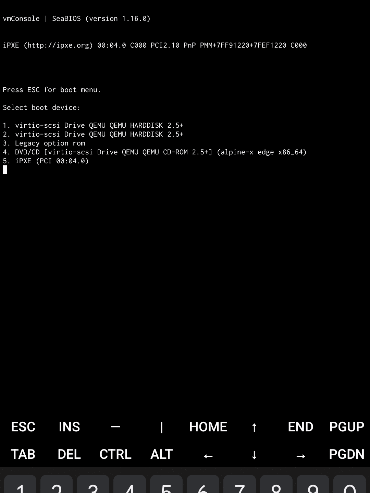

# vmConsole

vmConsole is an application for [Android OS] that provides a virtual machine
running [Alpine Linux] distribution. It utilizes [QEMU] x86_64 emulator as
its core and does not require device to be rooted or a custom kernel flashed.
Access to the operating system is performed through a text-based console.

It worth to note that this application is not a terminal emulator for
[Android OS], unlike [Termux], [ConnectBot] or [UserLAnd]. The environment
is isolated, which means will not have a direct access to device hardware
or various file system parts: vmConsole is not usable for automating device
functionality, exploring hidden [Android OS] paths with root, etc. Neither
usable as a rooting tool. Root permissions are same virtual as hardware
on which the [Alpine Linux] is running.

Optimal device properties for running this app:

* 64-bit CPU
* 8+ GB of RAM
* 8+ GB of disk space (if planning on-disk Alpine installation)

Typical use-cases of vmConsole application:

* Exploring the world of Linux =)
* Programming
* Testing software
* Hacking
* Running TOR hidden services
* Crawling / archiving web sites

Obviously, you can do more on Linux distribution, but remember that VM
performance is not high.

**This application requires proper Linux distribution administrator skills,
understanding the concept of emulators and virtual machines, what is a
"serial console", etc. Author will not be your mentor and no, author will
not teach you hacking.**

## About project

Let's begin from why vmConsole has been created. This project has been created
for my needs of sane Linux environment on Android OS. I know various apps
implementing [QEMU], e.g. [Limbo PC], but all of them are either not developed
anymore, have serious stability issues or just too flaky from design side. In
other words: totally unusable. On other hand, there is [Termux] which also
provides [QEMU]. In fact, vmConsole is even based on [Termux] project. But
anyway, [Termux] has own issues: lack of professional software packagers in
developer team, rejected Android developer guidelines which resulted in issues
with SELinux. [Termux] is not a production-ready distribution.

vmConsole could be seen as a composition of terminal emulator library and few
UI elements from [Termux] and standalone [QEMU] package, which resulted in
a completely different application.

This project is not community driven. As stated before, it has been created
for the personal needs of [author] and will continue to be developed according
to his point of view. The application is not guaranteed to be useful for you
or implement features that you request.

Here is a list of features that very unlikely to be implemented:

* Support of Android below version 7.0.
* Any kind of features that require rooted device.
* KVM support.
* TUN/TAP device support.
* USB support.
* Hardware passthrough.

Remember that author does not owe anything for you.

## Credits

- [Alpine Linux]: the operating system used in vmConsole.
- [ConnectBot]: the recommended SSH client for use with vmConsole.
- [QEMU]: the emulator and virtualizer, a core of vmConsole.
- [Termux]: the famous terminal emulator for Android OS, vmConsole uses certain parts of it.

[author]: https://github.com/sylirre
[Android OS]: https://www.android.com
[Alpine Linux]: https://alpinelinux.org
[ConnectBot]: https://github.com/connectbot/connectbot
[Limbo PC]: https://github.com/limboemu/limbo
[QEMU]: https://qemu.org
[Termux]: https://termux.dev
[UserLAnd]: https://github.com/CypherpunkArmory/UserLAnd
