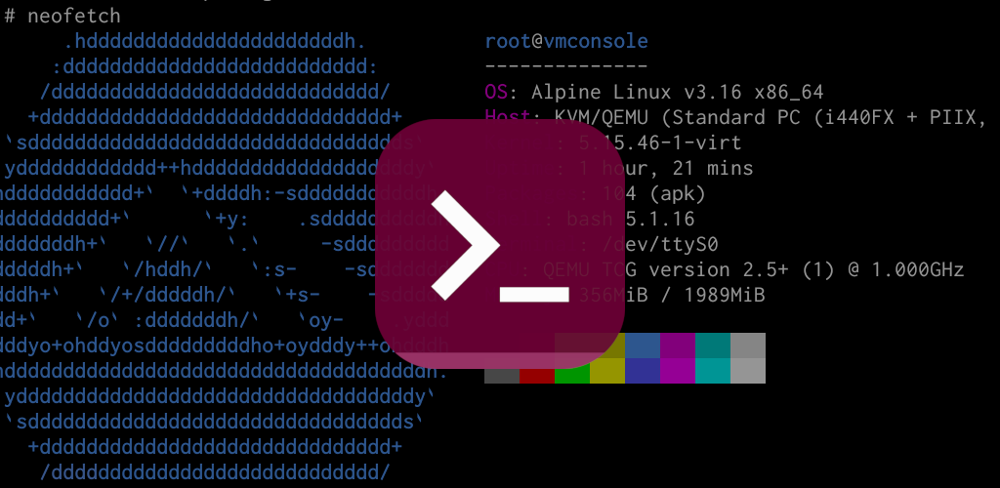

# vmConsole

vmConsole is an application for [Android OS] that provides a virtual machine
running [Alpine Linux] distribution. It utilizes [QEMU] x86_64 emulator as
its core and does not require device to be rooted or a custom kernel flashed.
Access to the operating system is performed through a text-based console.

It worth to note that this application is not a terminal emulator for
[Android OS], unlike [Termux], [ConnectBot] or [UserLAnd]. The environment
is isolated, which means will not have a direct access to device hardware
or various file system parts: vmConsole is not usable for automating device
functionality, exploring hidden [Android OS] paths with root, etc. Neither
usable as a rooting tool. Root permissions are same virtual as hardware
on which the [Alpine Linux] is running.

Typical use-cases of vmConsole application:

* Exploring the world of Linux =)
* Programming
* Testing software
* Hacking
* Running TOR hidden services
* Crawling / archiving web sites

Obviously, you can do more on Linux distribution, but remember that VM
performance is not high.

**This application requires proper Linux distribution administrator skills,
understanding the concept of emulators and virtual machines, what is a
"serial console", etc. Author will not be your mentor and no, author will
not teach you hacking.**

## Installation

Application is available on Google Play Store.

Optimal device properties for running this app:

* 64-bit CPU
* 8+ GB of RAM
* 8+ GB of disk space (if planning on-disk Alpine installation)

## VM properties

|VM property          |Details                                  |
|:--------------------|:----------------------------------------|
|OS                   |Alpine Linux, edge branch, diskless mode |
|Accelerator          |QEMU TCG                                 |
|CPU architecture     |x86_64                                   |
|CPU type             |max                                      |
|RAM size             |host-specific, 2047 MiB max              |
|Disk I size          |R/W, dynamic, up to 32 GiB, `/dev/sda`   |
|Disk II size         |R/W, dynamic, up to 32 GiB, `/dev/sdb`   |
|Network type         |User mode, emulated by SLiRP             |
|Graphical adapter    |disabled                                 |
|Parallel port        |disabled                                 |
|QEMU monitor         |disabled                                 |
|Android host storage |9P, mount tag `host_storage`             |

## About project

Let's begin from why vmConsole has been created. This project has been created
for my needs of sane Linux environment on Android OS. I know various apps
implementing [QEMU], e.g. [Limbo PC], but all of them are either not developed
anymore, have serious stability issues or just too flaky from design side. In
other words: totally unusable. On other hand, there is [Termux] which also
provides [QEMU]. In fact, vmConsole is even based on [Termux] project. But
anyway, [Termux] has own issues: lack of professional software packagers in
developer team, rejected Android developer guidelines which resulted in issues
with SELinux. [Termux] is not a production-ready distribution.

vmConsole could be seen as a composition of terminal emulator library and few
UI elements from [Termux] and standalone [QEMU] package, which resulted in
a completely different application.

This project is not community driven. As stated before, it has been created
for the personal needs of [author] and will continue to be developed according
to his point of view. The application is not guaranteed to be useful for you
or implement features that you request.

Here is a list of features that very unlikely to be implemented:

* Support of Android below version 7.0.
* Any kind of features that require rooted device.
* KVM support.
* TUN/TAP device support.
* USB support.
* Hardware passthrough.

Remember that author does not owe anything for you.

### Questions and Answers

#### Is that application related to Alpine Term and vShell previously available on GitHub?

Yes and in fact vmConsole is made by same developer ([me](https://github.com/sylirre)).

Note that *Alpine Term* and *vShell* projects are gone and should not be used
anymore — I usually shut down various experimental things before their community
will get too large.

#### Do you plan publishing on F-Droid?

Not for now. The main issues are build systems of Alpine Linux ISO and native
libraries. Both have heavy dependency on Docker with custom environment.

It is planned to publish APK on GitHub, in addition to Play Store distribution.

#### Do you plan localization?

Localizing just few labels of UI elements is pointless. The main part, i.e
operating system image, can't be localized. I'd like to avoid any incosistencies.

Therefore the answer is no and I will not accept the pull requests for this.

#### How can I make vmConsole faster?

You can't, as application emulates PC-like hardware. Running even a such simple
application as one printing "hello world" takes significantly more power than
running it on bare metal host. Obviously, the only way to make it faster is to
eliminate the emulator layer between host and your program.

vmConsole is not about speed. If speed is your priority, please use [Termux].

#### Why vmConsole is using Alpine Linux as operating system?

Because it is perfectly suitable for use in virtual machines, especially
emulators.

* Very small comparing to other distributions.
* Simple by design.
* No systemd.

I don't have any plans to change the Alpine Linux to something else unless
there would be a good reason for this.

#### Can I run other operating system?

Yes, you can. With a little effort of course. vmConsole provides several
disks:

* `/dev/cdrom`: read-only ISO image with Alpine Linux.
* `/dev/sda`: read-write user disk 1.
* `/dev/sdb`: read-write user disk 2.

So, you should be able to install a custom operating system on either
`/dev/sda` or `/dev/sdb`. Don't forget that your OS must do output over
serial console (`/dev/ttyS0`).

#### Why system image is not AArch64?

Because I need x86_64 and there no particular reason to use other architecture.
vmConsole emulates hardware (no KVM), no matter which target CPU is used. Use
of same architecture will not disable the emulation. Therefore even if AArch64
will give you some better performance (say +30%), that will be related solely
to emulator implementation differences.

#### Is KVM support planned?

Currently not, I generally against implementing any feature that would
require customizing firmware of device or at least rooting.

If Android will officially provide `/dev/kvm` accessible by regular apps,
then I will look into implementing KVM support. But remember that it would
be available only for x86_64 devices, since system image is for that CPU.

#### Is there any graphical output support?

vmConsole literally means: Virtual Machine Console. So main focus is the
text based terminal interface to the operating system. There no graphics
support. However in future versions I probably will look into adding VNC.

#### How to access QEMU monitor?

It is disabled for security reasons. For example you shared the device with
someone. Without QEMU monitor, that person will not be able to dump the
contents of disk or RAM. As soon as your device is not rooted, it will not
be possible to extract the data if vmConsole OS login is password-protected.

You will need a custom build of vmConsole in order to use the QEMU monitor.

#### How can I pass custom arguments to QEMU?

This application does not provide any way to configure QEMU by design. All
configuration is hardcoded ([see this](https://github.com/sylirre/vmConsole/blob/cf20aee3364aba654a2c65da5ac3d4ce268ee30a/app/src/main/java/sylirre/vmconsole/TerminalActivity.java#L373))
and part (such as RAM allocation) is determined automatically at runtime.

I want to keep the application as simple as possible, as I am not skilled
at Android application development. It has only necessary UI elements,
without any optional dialogs, screens, tabs, etc.

#### How can I customize port forwarding?

See answer about custom QEMU arguments.

Currently vmConsole will have only fixed forwardings for `22` and `80`
ports. In future may add more fixed forwardings for common ports. As a
workaround, use external SSH client (e.g. in [Termux]) to forward your
ports.

## Credits

- [Alpine Linux]: the operating system used in vmConsole.
- [ConnectBot]: the recommended SSH client for use with vmConsole.
- [QEMU]: the emulator and virtualizer, a core of vmConsole.
- [Termux]: the famous terminal emulator for Android OS, vmConsole uses certain parts of it.

[author]: https://github.com/sylirre
[Android OS]: https://www.android.com
[Alpine Linux]: https://alpinelinux.org
[ConnectBot]: https://github.com/connectbot/connectbot
[Limbo PC]: https://github.com/limboemu/limbo
[QEMU]: https://qemu.org
[Termux]: https://termux.dev
[UserLAnd]: https://github.com/CypherpunkArmory/UserLAnd
